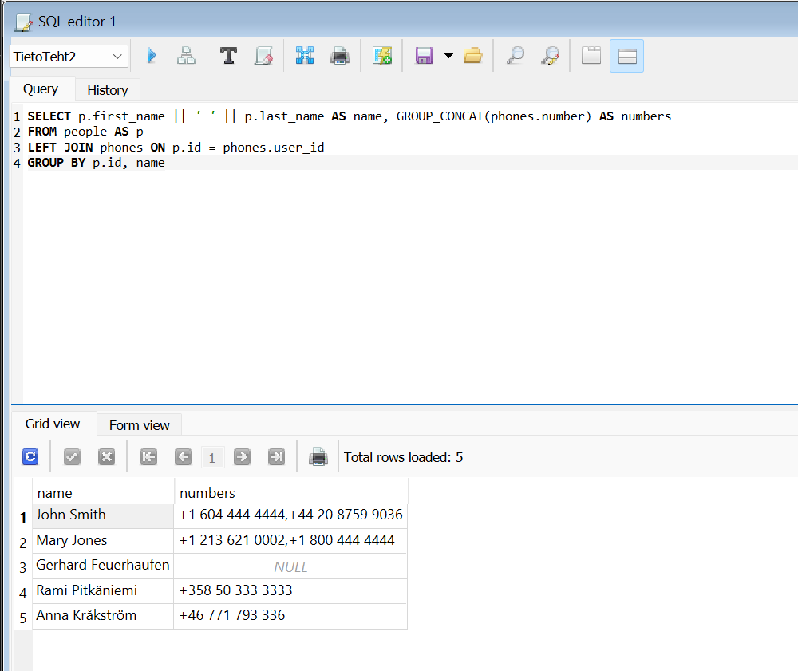
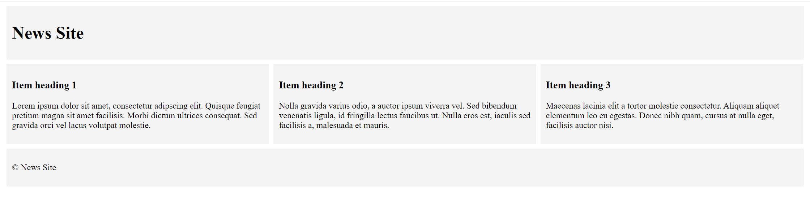
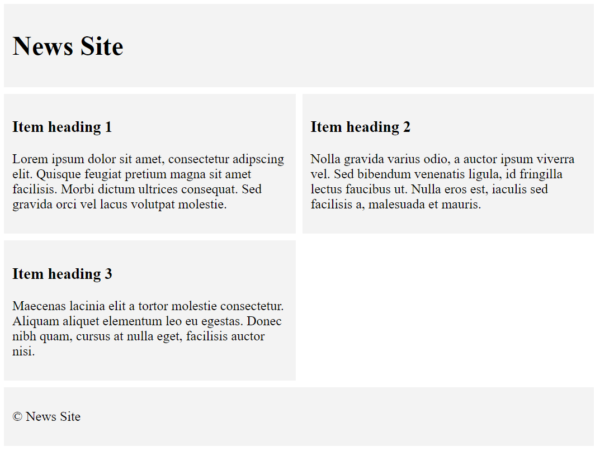

**Section 1 Question B**
The answer to the question is in the folder 'Loading Animation'.

cd Loading Animation
start index.html
or use Visual Studio Code Live Server extension

I chose this question because it is to do with front-end factors. First I planned what I was going to do and decided upon a simple loading animation. This was because I find it to be a better user-experience. Then I began to step by step build the solution, whilst finding ways to implement these steps. Starting with building the animation and then making the switches to change aspects of the animation. I needed to use some JavaScript in order to implement some of the functionalities. I made the basic functionalities first and then came back to make them better. 

**Section 2 Question B**
The answer to the question is in the file 'connect.sql'.

I used SQLiteStudio to solve the question like we learned in our database course:

The database course is also a reason I chose this exercise. I really enjoyed the course and found making queries logical and interesting. 

In SQLite I first created the tables and inserted data into them in order to test my solution in throughout the process. My solving process was quite simple, I began doing the different parts step by step. First I just selected the first name, last name and phone number and connected the two tables. From there I started to refine the query into one that would return the wanted result. The final query selects a combined persons first and last name in the given format labeled newly as name. It also selects the phone numbers, one or multiple. The group_concat there means that it concatenates multiple values of the phones.number column into a single string. Otherwise it would display one number per person. Next I express that I take this from table people, renamed as p in order to make the query shorter. People table is then left joined with the phones table based on user_id, by left joining we keep the values from people that do not have values in the phones table. Lastly I grouped the people by id and name so that I do not get many rows of the same person. 

**Section 3 Question D**
The answer to the question is in the folder 'New Site'.

cd New Site
start index.html
or use Visual Studio Code Live Server extension

I chose this question because it goes the position I am applying for working with fullstack development.

In making the simplified layout presented in the exercise I started by making the basic page layout and then focusing on the specifics. I divided the page into the header, body and footer. The header was very simple as well as the footer. The body took a little more work since it needed to respond to changing window size and rearrange the body. After this was done I still needed to make sure that the height of the items in the body would stay the same on each row. This was so that differing sized items do not distort everything. 

